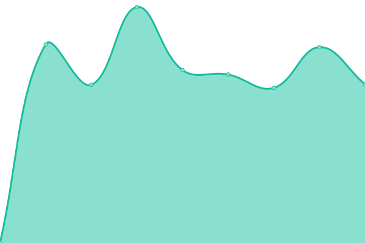
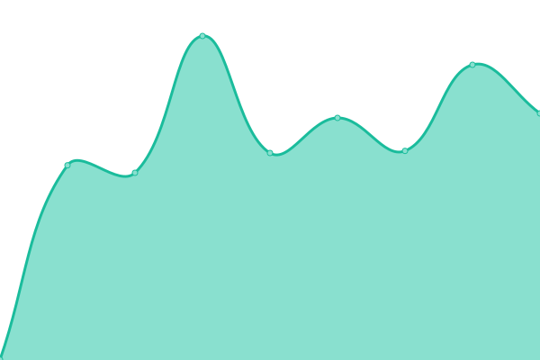
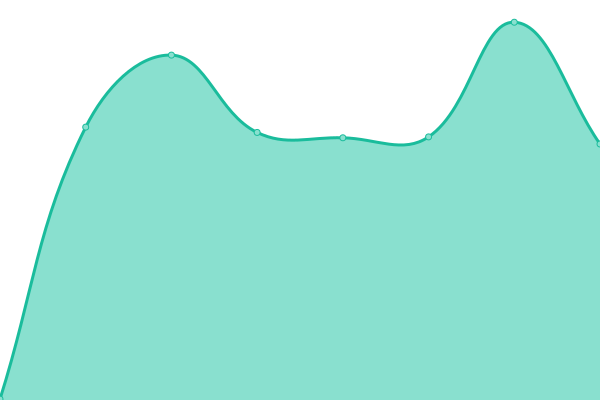
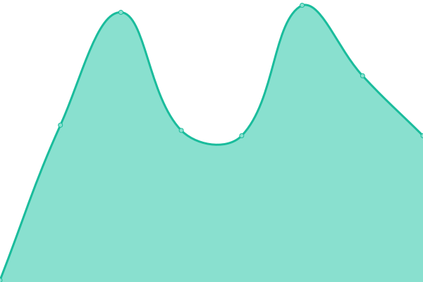
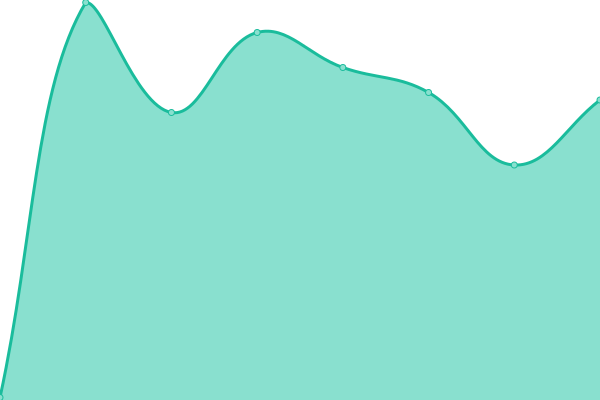
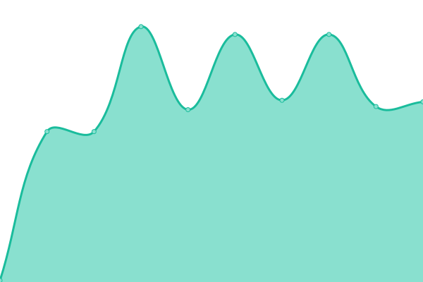

# [📈 Live Status](https://gekki-beep.github.io/status-page): <!--live status--> **🟧 Partial outage**

This repository contains the open-source uptime monitor and status page for [gekki-beep](https://gekki-beep.github.io/status-page), powered by [Upptime](https://github.com/upptime/upptime).

With [Upptime](https://upptime.js.org), you can get your own unlimited and free uptime monitor and status page, powered entirely by a GitHub repository. We use [Issues](https://github.com/gekki-beep/status-page/issues) as incident reports, [Actions](https://github.com/gekki-beep/status-page/actions) as uptime monitors, and [Pages](https://gekki-beep.github.io/status-page) for the status page.

<!--start: status pages-->
<!-- This summary is generated by Upptime (https://github.com/upptime/upptime) -->
<!-- Do not edit this manually, your changes will be overwritten -->
<!-- prettier-ignore -->
| URL | Status | History | Response Time | Uptime |
| --- | ------ | ------- | ------------- | ------ |
|  [iFive](https://ifive-community.fr) | Arrêt | [i-five.yml](https://github.com/Gekki-beep/status-page/commits/HEAD/history/i-five.yml) | 

 327ms
     
 | 

<a href="https://gekki-beep.github.io/status-page/history/i-five">0.00%</a>
    

|  [Poudlard](https://poudlard.ifive-community.fr) | Opérationnel | [poudlard.yml](https://github.com/Gekki-beep/status-page/commits/HEAD/history/poudlard.yml) | 

 985ms
     
 | 

<a href="https://gekki-beep.github.io/status-page/history/poudlard">100.00%</a>
    

|  [DarkRP](https://darkrp.ifive-community.fr) | Opérationnel | [dark-rp.yml](https://github.com/Gekki-beep/status-page/commits/HEAD/history/dark-rp.yml) | 

 928ms
     
 | 

<a href="https://gekki-beep.github.io/status-page/history/dark-rp">100.00%</a>
    

|  [Boutique](https://boutique.ifive-community.fr) | Opérationnel | [boutique.yml](https://github.com/Gekki-beep/status-page/commits/HEAD/history/boutique.yml) | 

 645ms
     
 | 

<a href="https://gekki-beep.github.io/status-page/history/boutique">100.00%</a>
    

|  [Wiki](https://wiki.ifive-community.fr) | Opérationnel | [wiki.yml](https://github.com/Gekki-beep/status-page/commits/HEAD/history/wiki.yml) | 

 480ms
     
 | 

<a href="https://gekki-beep.github.io/status-page/history/wiki">100.00%</a>
    

|  [Panel](https://panel.ifive-community.fr/) | Opérationnel | [panel.yml](https://github.com/Gekki-beep/status-page/commits/HEAD/history/panel.yml) | 

 420ms
     
 | 

<a href="https://gekki-beep.github.io/status-page/history/panel">100.00%</a>
    

|  [Node01](http://node01.ifive-community.fr/) | Arrêt | [node01.yml](https://github.com/Gekki-beep/status-page/commits/HEAD/history/node01.yml) | 

 1015ms
     
 | 

<a href="https://gekki-beep.github.io/status-page/history/node01">100.00%</a>
    

|  [Node02](https://node02.ifive-community.fr/) | Opérationnel | [node02.yml](https://github.com/Gekki-beep/status-page/commits/HEAD/history/node02.yml) | 

 437ms
     
 | 

<a href="https://gekki-beep.github.io/status-page/history/node02">100.00%</a>
    

|  [SQL01](https://node02.ifive-community.fr/pma) | Opérationnel | [sql-01.yml](https://github.com/Gekki-beep/status-page/commits/HEAD/history/sql-01.yml) | 

 370ms
     
 | 

<a href="https://gekki-beep.github.io/status-page/history/sql-01">100.00%</a>
    

|  [Gekki](https://gekki.fr) | Arrêt | [gekki.yml](https://github.com/Gekki-beep/status-page/commits/HEAD/history/gekki.yml) | 

 0ms
     
 | 

<a href="https://gekki-beep.github.io/status-page/history/gekki">0.00%</a>
    

|  [Discord](https://discord.com/api/v10) | Arrêt | [discord.yml](https://github.com/Gekki-beep/status-page/commits/HEAD/history/discord.yml) | 

 41ms
     
 | 

<a href="https://gekki-beep.github.io/status-page/history/discord">0.00%</a>
    

|  [Steam](https://api.steampowered.com) | Opérationnel | [steam.yml](https://github.com/Gekki-beep/status-page/commits/HEAD/history/steam.yml) | 

 801ms
     
 | 

<a href="https://gekki-beep.github.io/status-page/history/steam">100.00%</a>
    

|  [iFive DarkRP](node02.ifive-community.fr) | Arrêt | [i-five-dark-rp.yml](https://github.com/Gekki-beep/status-page/commits/HEAD/history/i-five-dark-rp.yml) | 

 0ms
     
 | 

<a href="https://gekki-beep.github.io/status-page/history/i-five-dark-rp">0.00%</a>
    

|  [iFive CW](node02.ifive-community.fr) | Opérationnel | [i-five-cw.yml](https://github.com/Gekki-beep/status-page/commits/HEAD/history/i-five-cw.yml) | 

 134ms
     
 | 

<a href="https://gekki-beep.github.io/status-page/history/i-five-cw">100.00%</a>
    

|  [iFive Poudlard](node03.ifive-community.fr) | Arrêt | [i-five-poudlard.yml](https://github.com/Gekki-beep/status-page/commits/HEAD/history/i-five-poudlard.yml) | 

 0ms
     
 | 

<a href="https://gekki-beep.github.io/status-page/history/i-five-poudlard">0.00%</a>
    

<!--end: status pages-->

[**Visit our status website →**](https://gekki-beep.github.io/status-page)

## 📄 License

- Powered by: [Upptime](https://github.com/upptime/upptime)
- Code: [MIT](./LICENSE) © [gekki-beep](https://gekki-beep.github.io/status-page)
- Data in the `./history` directory: [Open Database License](https://opendatacommons.org/licenses/odbl/1-0/)
