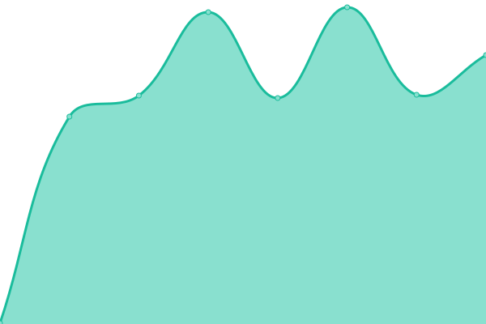
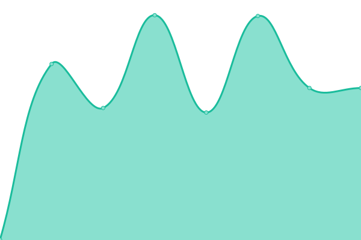

# [📈 Live Status](https://gekki-beep.github.io/status-page): <!--live status--> **🟧 Partial outage**

This repository contains the open-source uptime monitor and status page for [gekki-beep](https://gekki-beep.github.io/status-page), powered by [Upptime](https://github.com/upptime/upptime).

With [Upptime](https://upptime.js.org), you can get your own unlimited and free uptime monitor and status page, powered entirely by a GitHub repository. We use [Issues](https://github.com/gekki-beep/status-page/issues) as incident reports, [Actions](https://github.com/gekki-beep/status-page/actions) as uptime monitors, and [Pages](https://gekki-beep.github.io/status-page) for the status page.

<!--start: status pages-->
<!-- This summary is generated by Upptime (https://github.com/upptime/upptime) -->
<!-- Do not edit this manually, your changes will be overwritten -->
<!-- prettier-ignore -->
| URL | Status | History | Response Time | Uptime |
| --- | ------ | ------- | ------------- | ------ |
|  [Panel](https://pterodactyl.ifive-roleplay.fr/) | Arrêt | [panel.yml](https://github.com/Gekki-beep/status-page/commits/HEAD/history/panel.yml) | 

 185ms
     
 | 

<a href="https://gekki-beep.github.io/status-page/history/panel">100.00%</a>
    

|  [API Panel](https://pterodactyl.ifive-roleplay.fr/api/client/) | Arrêt | [api-panel.yml](https://github.com/Gekki-beep/status-page/commits/HEAD/history/api-panel.yml) | 

 22ms
     
 | 

<a href="https://gekki-beep.github.io/status-page/history/api-panel">0.00%</a>
    

|  [API](http://node04.ifive-community.fr:10003/ifive) | Opérationnel | [api.yml](https://github.com/Gekki-beep/status-page/commits/HEAD/history/api.yml) | 

 318ms
     
 | 

<a href="https://gekki-beep.github.io/status-page/history/api">57.50%</a>
    

|  [Node04](http://node04.ifive-community.fr/) | Opérationnel | [node04.yml](https://github.com/Gekki-beep/status-page/commits/HEAD/history/node04.yml) | 

 293ms
     
 | 

<a href="https://gekki-beep.github.io/status-page/history/node04">57.50%</a>
    

|  [SQL01](https://pterodactyl.ifive-roleplay.fr/pma) | Arrêt | [sql-01.yml](https://github.com/Gekki-beep/status-page/commits/HEAD/history/sql-01.yml) | 

 26ms
     
 | 

<a href="https://gekki-beep.github.io/status-page/history/sql-01">100.00%</a>
    

|  [Wiki](https://wiki.ifive-community.fr) | Opérationnel | [wiki.yml](https://github.com/Gekki-beep/status-page/commits/HEAD/history/wiki.yml) | 

 9147ms
     
 | 

<a href="https://gekki-beep.github.io/status-page/history/wiki">57.51%</a>
    

|  [Grafana](http://node04.ifive-community.fr:10004) | Opérationnel | [grafana.yml](https://github.com/Gekki-beep/status-page/commits/HEAD/history/grafana.yml) | 

 673ms
     
 | 

<a href="https://gekki-beep.github.io/status-page/history/grafana">57.52%</a>
    

|  [Discord](https://discord.com/) | Opérationnel | [discord.yml](https://github.com/Gekki-beep/status-page/commits/HEAD/history/discord.yml) | 

 121ms
     
 | 

<a href="https://gekki-beep.github.io/status-page/history/discord">100.00%</a>
    

|  [Steam](https://api.steampowered.com) | Opérationnel | [steam.yml](https://github.com/Gekki-beep/status-page/commits/HEAD/history/steam.yml) | 

 250ms
     
 | 

<a href="https://gekki-beep.github.io/status-page/history/steam">100.00%</a>
    

|  [iFive FiveM](node04.ifive-community.fr) | Opérationnel | [i-five-five-m.yml](https://github.com/Gekki-beep/status-page/commits/HEAD/history/i-five-five-m.yml) | 

 128ms
     
 | 

<a href="https://gekki-beep.github.io/status-page/history/i-five-five-m">57.53%</a>
    

|  [CFX](https://cfx.re/join/pzvm47) | Arrêt | [cfx.yml](https://github.com/Gekki-beep/status-page/commits/HEAD/history/cfx.yml) | 

 1161ms
     
 | 

<a href="https://gekki-beep.github.io/status-page/history/cfx">0.00%</a>
    

|  [API CFX](https://status.cfx.re/api/v2/status.json) | Arrêt | [api-cfx.yml](https://github.com/Gekki-beep/status-page/commits/HEAD/history/api-cfx.yml) | 

 381ms
     
 | 

<a href="https://gekki-beep.github.io/status-page/history/api-cfx">88.41%</a>
    

<!--end: status pages-->

[**Visit our status website →**](https://gekki-beep.github.io/status-page)

## 📄 License

- Powered by: [Upptime](https://github.com/upptime/upptime)
- Code: [MIT](./LICENSE) © [gekki-beep](https://gekki-beep.github.io/status-page)
- Data in the `./history` directory: [Open Database License](https://opendatacommons.org/licenses/odbl/1-0/)
